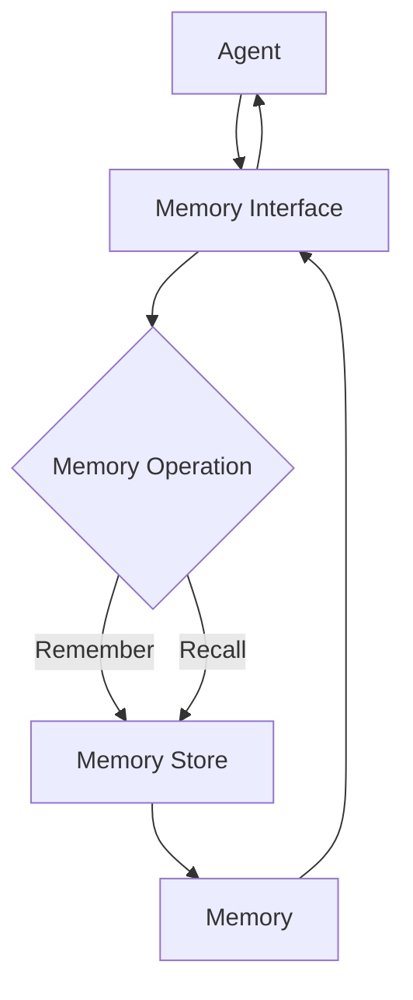

# Proposed V1 Architecture

## Scope

V1 will answer one question: can an agent remember information and retrieve it later during the same process? This document is a proposal, not an implemented architecture. V1 will not decide what deserves storage, resolve contradictions, rank evidence, or persist data across restarts.



## Memory model

```json
{
  "id": "mem_001",
  "content": "User prefers React for frontend development",
  "created_at": "2026-09-26T10:00:00+00:00",
  "source": "conversation"
}
```

No fields were added beyond the initial model:

- `id` distinguishes stored memories.
- `content` is the information being remembered.
- `created_at` records when this store observed it.
- `source` records its immediate origin.

## Proposed components and decisions

### Memory

**Problem solved:** provides one explicit, inspectable representation for a stored fact.

**Why now:** remember and recall need to agree on what is stored and returned.

**Without it:** callers would exchange unstructured dictionaries or strings, making even the four V1 fields inconsistent.

**Why this design:** a standard-library frozen data class is smaller and safer than a validation library or schema framework. It has only the requested fields.

### Memory store

**Problem solved:** owns the collection of memories, assigns process-local IDs, and searches their content.

**Why now:** an agent cannot retrieve information unless something retains it.

**Without it:** `remember` would have no durable-in-process effect.

**Why this design:** a list is sufficient for an experiment and makes the retrieval behavior obvious. A database would add setup and failure modes before V1 needs persistence or scale.

### Memory interface

**Problem solved:** exposes the agent-facing `remember(content, source)` and `recall(query)` operations while hiding storage details.

**Why now:** these operations are the required public boundary, and this seam gives a later JEV layer a natural insertion point.

**Without it:** agents would depend directly on the store and future admission or retrieval decisions would require changing every caller.

**Why this design:** it is a small concrete class, not an abstract base class, protocol, factory, or service layer. Those abstractions would have only one implementation in V1.

## Proposed retrieval behavior

Recall is proposed to perform a case-insensitive substring scan over memory content and return matches in insertion order. An empty query would return no matches.

This choice is deterministic, dependency-free, and easy to test. It does not understand synonyms, meaning, spelling variation, importance, or recency. Those are observed limitations, not features to pre-build.

## Expected V1 limitations

- Memories disappear when the process exits.
- Lookup is linear in the number of memories.
- Retrieval only recognizes literal substrings.
- Every submitted memory is admitted.
- Duplicates and contradictions are preserved without evaluation.
- IDs are unique only within one store instance.

These expectations must be validated by a future bounded V1 implementation task. JEV remains outside V1.
