# Memory-ops

Memory-ops is an agent-independent Memory-as-a-Service platform for securely
storing, retrieving, correcting, and forgetting scoped memories through HTTPS
APIs and typed SDKs.

The project is specification-first and evaluation-gated: every milestone starts
with a versioned dataset and explicit thresholds, then finishes with deterministic
tests and a protected holdout.

## Current status

| Milestone | Status | Delivered |
| --- | --- | --- |
| M0 — Foundation | Verified | FastAPI service, OpenAPI contract, authorization boundary, PostgreSQL tenant isolation, idempotency, transactional outbox, worker foundation, and content-free audit telemetry |
| M1 — Explicit memory | Verified | Canonical user-memory model, immutable versions, explicit `remember`, `inspect`, and `list` operations, plus Python and TypeScript SDKs |
| M2 — Memory lifecycle | Verified | Temporal queries, immutable corrections, conflict decisions, immediate revocation, complete purge receipts, and deletion-aware restore |
| M3 — Governed retrieval | Verified | Scoped exact, filtered, keyword, and vector retrieval plus canonical hydration, token-budgeted context, abstention, and protected comparison evidence |
| M4 — Governed extraction | Verified | Non-persisting shadow extraction, category-specific quality gates, dual-review evidence, and fail-closed promotion decisions |
| M5 — Agent learning | Verified | Structured episodes, immutable candidate lessons, paired evaluation, scoped canary selection, monitoring, pause, and rollback |
| M6 — Organizational knowledge | Verified | Private document versions, structure-aware parsing, immutable ACL revisions, current-source retrieval, exact citations, conflict and injection warnings, and protected holdout evidence |

RRF ranking is implemented but remains disabled because its protected comparison
missed the predeclared relative-latency gate. The released path uses keyword
retrieval with a confidence-gated local-vector fallback.

## Architecture



Canonical state lives in Lakebase Postgres on Neon. Writes commit the canonical
version, idempotency receipt, and outbox event atomically. Derived indexes are
rebuildable and are never authoritative.

Security is enforced before storage and retrieval:

- deny-by-default tenant and workspace authorization;
- PostgreSQL row-level security as defense in depth;
- prohibited-secret rejection before persistence;
- content-free operational audit events; and
- no acknowledgement before canonical state and durable work notification commit.

Milestone architecture and evidence:

- [M0 — Foundation](docs/architecture/m0/README.md)
- [M1 — Explicit memory](docs/architecture/m1/README.md)
- [M2 — Lifecycle](docs/architecture/m2/README.md)
- [M3 — Governed retrieval](docs/architecture/m3/README.md)
- [M4 — Governed extraction](docs/architecture/m4/README.md)
- [M5 — Agent learning](docs/architecture/m5/README.md)
- [M6 — Organizational knowledge](docs/architecture/m6/README.md)

The complete product contract is in [SPEC.md](SPEC.md). The approved delivery plan and current
proof status are in [.genesis/PLAN.md](.genesis/PLAN.md) and
[.genesis/KICKOFF.md](.genesis/KICKOFF.md).

## Requirements

- Python 3.12+
- [uv](https://docs.astral.sh/uv/)
- Node.js and npm for the TypeScript SDK and Neon tooling
- A linked Neon project and development branch

## Local setup

Install dependencies:

```bash
uv sync
npm install
npm install --prefix sdk/typescript
```

Use a dedicated Neon branch for development. Linking or checking out a branch
pulls its environment variables into `.env` when that file already exists.

```bash
cp .env.example .env
neon link
neon checkout dev-memory-ops --create
```

Never commit populated environment files. The application uses the pooled
`DATABASE_URL` at runtime and `DATABASE_URL_UNPOOLED` for migrations. The committed
[`.env.example`](.env.example) documents the required variable names; `.env.local` and
`.env.test` are intended for local and isolated-test configuration.

Apply migrations and start the API:

```bash
uv run --env-file .env memory-ops-migrate
uv run --env-file .env memory-ops-api
```

The service listens on `http://localhost:8000`:

```bash
curl http://localhost:8000/health/live
curl http://localhost:8000/v1/openapi.json
```

Run the worker in a separate process when testing asynchronous work:

```bash
uv run --env-file .env memory-ops-worker
```

## Implemented API

All memory routes require bearer authentication and are scoped by tenant and
workspace.

| Method | Path | Purpose |
| --- | --- | --- |
| `POST` | `/v1/tenants/{tenant_id}/workspaces/{workspace_id}/memories` | Store an explicit memory idempotently |
| `GET` | `/v1/tenants/{tenant_id}/workspaces/{workspace_id}/memories/{memory_id}` | Inspect a current memory |
| `DELETE` | `/v1/tenants/{tenant_id}/workspaces/{workspace_id}/memories/{memory_id}` | Revoke a memory and schedule complete purge |
| `GET` | `/v1/tenants/{tenant_id}/workspaces/{workspace_id}/memories` | List current memories with subject and purpose filters |
| `GET` | `/v1/tenants/{tenant_id}/workspaces/{workspace_id}/operations/{operation_id}` | Inspect asynchronous operation status |
| `POST` | `/v1/tenants/{tenant_id}/workspaces/{workspace_id}/context` | Build governed, token-budgeted user-memory context |
| `POST` | `/v1/tenants/{tenant_id}/workspaces/{workspace_id}/knowledge/search` | Retrieve authorized, current organizational passages with exact citations |
| `POST` | `/v1/tenants/{tenant_id}/workspaces/{workspace_id}/agent-lessons/{candidate_id}/promotions` | Promote an evaluated lesson into scoped canary use |
| `POST` | `/v1/tenants/{tenant_id}/workspaces/{workspace_id}/agent-lessons/{candidate_id}/monitoring` | Record monitoring evidence and activate or pause a canary lesson |
| `POST` | `/v1/tenants/{tenant_id}/workspaces/{workspace_id}/agent-lessons/{candidate_id}/rollback` | Roll back a promoted lesson and make it unselectable |

The published machine-readable contract is [openapi/openapi.json](openapi/openapi.json).

Organizational document bodies live in private S3-compatible object storage. Lakebase Postgres
stores their canonical metadata, immutable versions, ACL revisions, parse state, exact locators,
and rebuildable search projections. Retrieved document text is evidence, not executable policy,
and is always returned as untrusted content.

## SDKs

Equivalent typed clients are available for Python and TypeScript:

- [Python SDK](sdk/python/README.md)
- [TypeScript SDK](sdk/typescript/README.md)

Both currently support remember, inspect, list, and operation-status requests.

## Verification

Run the Python suite against an isolated test branch:

```bash
uv run --env-file .env.test python -m pytest
```

Run the TypeScript SDK checks:

```bash
npm test --prefix sdk/typescript
```

Run verified milestone suites:

```bash
uv run --env-file .env.test python scripts/verify_milestone.py m0
uv run --env-file .env.test python scripts/verify_milestone.py m1
uv run --env-file .env.test python scripts/verify_milestone.py m2
uv run --env-file .env.test python scripts/verify_milestone.py m3
uv run --env-file .env.test python scripts/verify_milestone.py m4
uv run --env-file .env.test python scripts/verify_milestone.py m5
uv run --env-file .env.test python scripts/verify_milestone.py m6
```

Validate the latest milestone evaluation contract:

```bash
uv run python scripts/evals/validate_contract.py evals/m6/contract.yaml
```

Each `evals/mN/` directory contains the milestone contract, versioned development data, protected
holdout evidence where applicable, and source-bound published results. Reproducing the measured
M4 quality candidate or M5 paired model run requires the configured Azure credential; the M6
holdout and release evaluator are credential-free.

## Repository layout

```text
src/memory_ops/     API, security, persistence, memory, retrieval, learning, knowledge, and workers
migrations/         Alembic PostgreSQL migrations
openapi/            Published API contract
sdk/                Python and TypeScript clients
tests/              Component and integration tests
evals/              Versioned milestone contracts, datasets, and results
docs/architecture/  Architecture sources, renders, and explanations
.genesis/           Specification-first workflow state and proof records
```

## Delivery roadmap

M0 through M6 are verified. M7 will assemble cross-domain context without flattening the
authority of user memory, agent learning, or organizational knowledge. M8 covers production
hardening, observability, deployment evidence, and the final architecture refresh. Planned
features are not exposed until their milestone gates pass.
