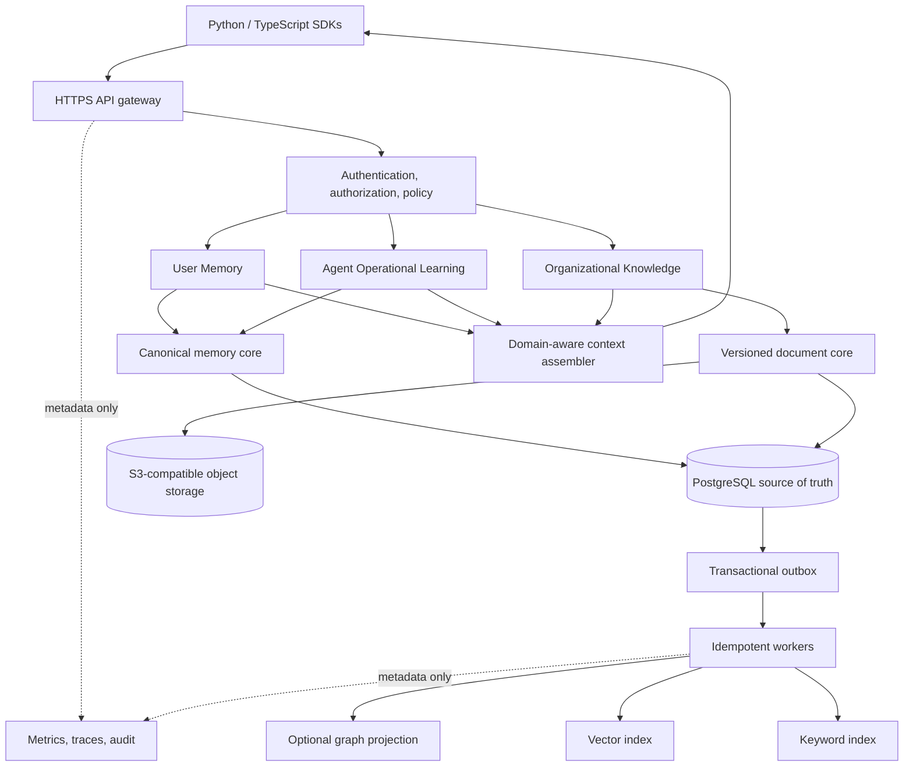
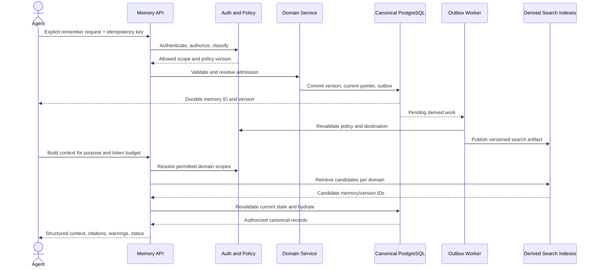
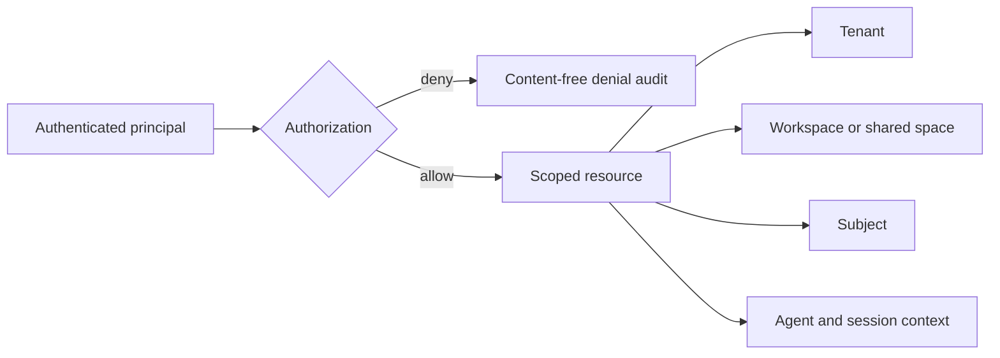
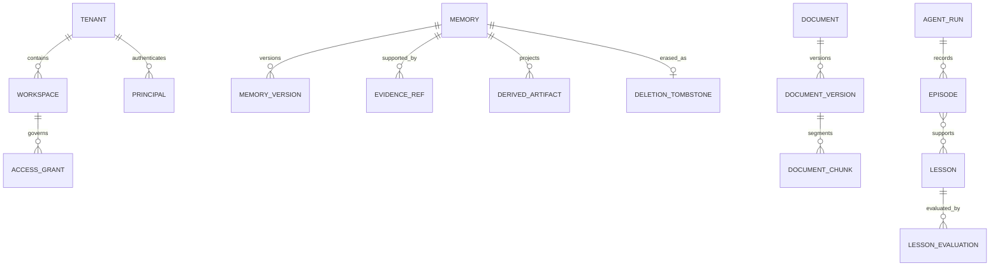
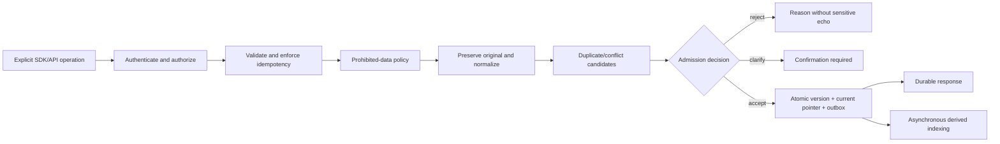
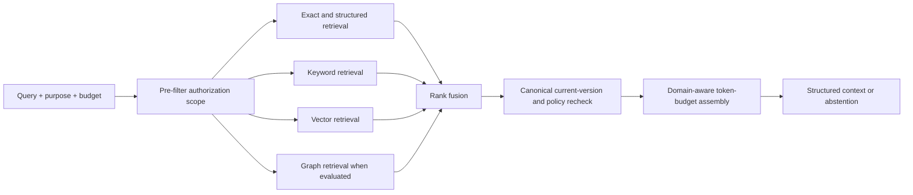
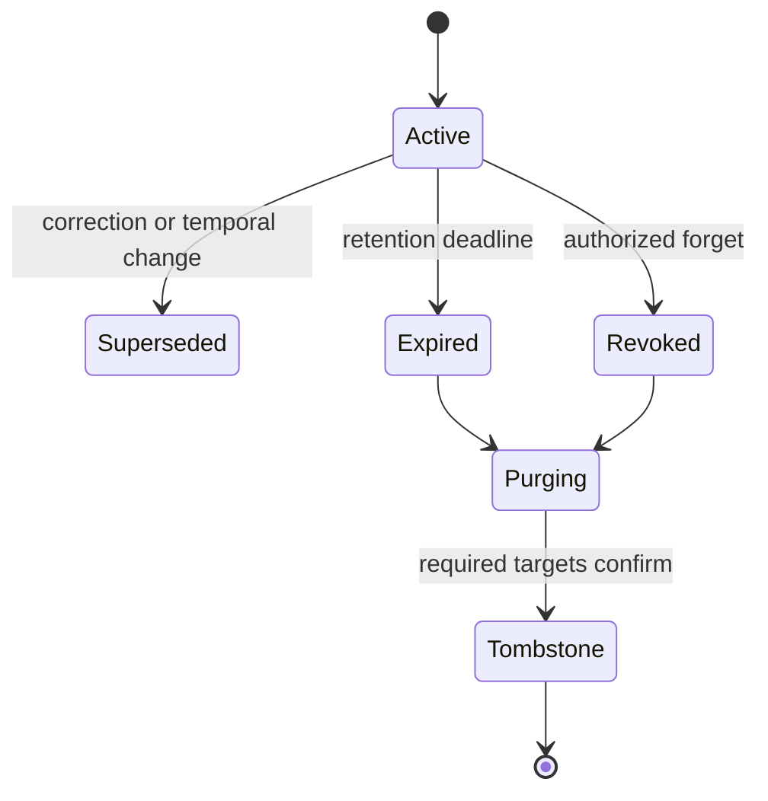
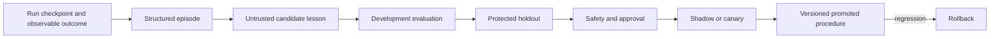
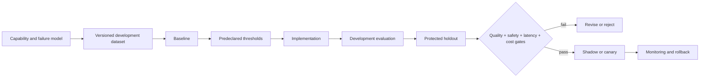

# Product specification — Memory-ops

> Status: draft for human review. Product implementation is prohibited until this specification and the subsequent implementation plan are explicitly approved through Genesis.

## Executive summary

Memory-ops is an agent-independent, multi-tenant Memory-as-a-Service platform. Agents use HTTPS APIs or Python and TypeScript SDKs to store, retrieve, correct, and forget scoped memory. One gateway exposes three bounded domains without mixing their authority:

1. User Memory — facts, preferences, goals, constraints, and episodes about a person.
2. Agent Operational Learning — checkpoints, observed run outcomes, candidate lessons, and evaluated procedures.
3. Organizational Knowledge — versioned source documents and cited passages.

V1 launches explicit user-memory operations. Automatic extraction exists only in non-persisting shadow mode until each category passes a predeclared evaluation and trust gate.

## Problem

Agents commonly lose useful context between sessions, duplicate or contradict prior facts, retrieve stale information, confuse user preferences with organizational policy, and lack reliable correction or deletion. Existing point solutions often optimize retrieval while leaving identity, authorization, temporal truth, provenance, deletion, evaluation, and cross-agent reuse underspecified.

The desired outcome is a reusable memory layer that any authorized agent can call without owning memory infrastructure, while users and organizations retain control over scope, provenance, correction, retention, and erasure.

## Users

- Agent developers integrate applications through SDKs and HTTPS APIs.
- End users are the subjects of user memories and can explicitly remember, correct, inspect, and forget them through an authorized application.
- Tenant and workspace administrators govern agents, scopes, organizational sources, retention, and access grants.
- Evaluators and operators validate quality, safety, reliability, deletion, and cost without accessing raw content unnecessarily.

## Product outcomes

- An agent can safely reuse relevant context across sessions.
- Multiple authorized agents can share selected memory without sharing everything.
- Current truth, historical truth, and when the system learned something remain distinguishable.
- Every returned memory has a known domain, scope, version, provenance, and lifecycle state.
- Incorrect, expired, prohibited, or forgotten information cannot silently reappear from a derived index.
- Every milestone proves its value and safety through a versioned layered evaluation.

## Design principles

- Canonical truth is separate from rebuildable search representations.
- Tenant isolation is absolute; workspace and cross-agent sharing are explicit.
- Caller, subject, agent, tenant, workspace, session, and resource are distinct concepts.
- Policy denial outranks forgetting, correction, remembering, and automatic extraction; explicit user actions outrank automation.
- Retrieved policy text can be cited but cannot enforce policy.
- Uncertainty is surfaced; the service may abstain instead of inventing memory.
- Complexity is added only after an evaluation demonstrates a need.

## North-star architecture



The V1 deployment is a modular service plus worker rather than microservices. PostgreSQL owns canonical state and initially provides full-text and vector search when evaluation gates pass. Redis, Kafka, Kubernetes, dedicated vector storage, and dedicated graph storage are upgrade paths, not assumed dependencies.

## End-to-end runtime flow

Architecture documentation must show how the system behaves, not merely list its components. The canonical write-to-read flow is:



Every milestone must maintain flow-oriented Mermaid source. Diagrams must identify actors, trust boundaries, synchronous and asynchronous paths, decisions, state/storage changes, and degraded or denied outcomes where relevant. Each milestone supplies a before/after system-flow diagram rather than relying only on a static component map.

## Identity and authorization model



Authorization is deny-by-default:

\[
Allow = Authenticated \land TenantMatch \land RoleAllows \land ScopeAllows \land PolicyAllows \land \neg ExplicitDeny
\]

Tenant and trusted workspace context are derived from credentials and grants rather than accepted blindly from a request body. Workspace data is private by default. Cross-workspace sharing uses tenant-level shared spaces and explicit read/write grants to canonical resources rather than copied content.

## Canonical memory and temporal model



A logical memory has a stable `memory_id`; immutable `memory_version` records hold:

- Identity: tenant, workspace or shared space, subject, agent, semantic type.
- Meaning: original statement, normalized subject/predicate/value, qualifiers.
- Valid time: when the claim is true in the represented world.
- Recorded time: when the system learned or changed it.
- Provenance: explicit, extracted, or derived origin and controlled evidence references.
- Governance: sensitivity, purpose, policy version, access scope, retention.
- Lifecycle: active, superseded, expired, revoked, or deleted.

Embeddings, keyword documents, graph edges, summaries, profiles, ranks, and confidence features are derived artifacts. They carry `memory_id`, `version_id`, index generation, and model version and are never canonical truth.

## Write and admission flow



Hard validation, authorization, policy, idempotency, and canonical persistence are synchronous. Optional model enrichment and derived indexing are asynchronous. Every asynchronous destination revalidates current policy and scope before publishing.

## Duplicate, contradiction, and correction rules

- Equivalent repeated statements add evidence to one logical memory; they do not create duplicates or automatically prove truth.
- Claims with compatible but distinct qualifiers may coexist.
- A real-world change closes the prior valid-time interval and creates a new version.
- An explicit correction supersedes an incorrect version.
- Ambiguous explicit contradictions require confirmation.
- Automatic extraction never overrides policy or an explicit remember, correction, or forget operation.
- Deterministic matching is attempted first; semantic retrieval produces candidates but an LLM cannot silently rewrite history.

## Retrieval and context assembly



Reciprocal Rank Fusion is the initial score-independent hybrid baseline:

\[
RRF(d)=\sum_{i=1}^{n}\frac{1}{k+rank_i(d)}
\]

It remains enabled only if it meets the holdout gate against the best individual retriever. Context selection maximizes useful evidence within a token budget:

\[
\max \sum_i utility_i x_i \quad \text{subject to} \quad \sum_i tokens_i x_i \le B
\]

V1 may use deterministic greedy selection. Current critical constraints and machine-policy results are hard requirements rather than optional score boosts.

For every returned candidate:

\[
Return(m,v) \iff v=currentVersion(m) \land status(m)=active \land Authorized(m)
\]

## Cross-domain authority

One context read API retrieves each domain independently and returns separate sections:

- `user_memory`: current user facts, preferences, goals, constraints, and episodes.
- `agent_learning`: applicable promoted procedures and permitted run state.
- `organizational_knowledge`: current cited passages and source metadata.
- `warnings`: conflicts, staleness, abstention, or unavailable domains.

Machine-enforced policy remains outside retrieved content and has deny precedence. Organizational documents cannot override it; agent lessons cannot override policy or user constraints; user preferences cannot rewrite organizational facts. A failed domain produces an explicit partial response.

## Lifecycle and deletion



Revocation becomes effective synchronously. Purge work removes canonical content, controlled evidence, keyword/vector documents, graph links, summaries, and caches with retryable per-target receipts. Soft deletion or archival does not satisfy forgetting. A permitted tombstone contains no reconstructive content. Restores must replay deletion state before serving traffic.

\[
DeletionCompleteness=\frac{ConfirmedRequiredTargets}{ExpectedRequiredTargets}=1
\]

## Agent operational learning



Private chain-of-thought, credentials, and arbitrary sensitive tool output are not stored. A lesson is scoped to compatible agent, task, tool/version, and environment. Cross-agent sharing requires explicit evaluated promotion. Merely using a lesson is not evidence that it is correct.

\[
Promote = HoldoutPass \land \Delta Quality \ge \tau \land CriticalSafetyViolations=0 \land CostWithinBudget \land RequiredApproval
\]

## Organizational knowledge

Original documents are versioned, access-controlled sources. Structure-aware parsing preserves sections, pages, tables, lists, and code symbols. Chunks and extracted entities remain derived. Every returned passage includes document/version identity and an exact source locator. Draft, approved, deprecated, effective, expired, stale, and deleted states affect retrieval. Conflicting approved sources are surfaced rather than silently merged. Retrieved content is untrusted data and cannot authorize actions.

## API surface

All endpoints are versioned under `/v1`. Authentication determines tenant context; trusted grants determine workspace/shared-space access. Mutations accept an idempotency key.

```text
POST   /v1/user-memories
GET    /v1/user-memories/{memory_id}
POST   /v1/user-memories/{memory_id}/corrections
DELETE /v1/user-memories/{memory_id}
POST   /v1/user-memories/search

POST   /v1/agent-runs/{run_id}/checkpoints
POST   /v1/agent-runs/{run_id}/episodes
GET    /v1/agent-lessons
POST   /v1/agent-lessons/{lesson_id}/promotions
POST   /v1/agent-lessons/{lesson_id}/rollback

POST   /v1/knowledge/documents
GET    /v1/knowledge/documents/{document_id}
DELETE /v1/knowledge/documents/{document_id}
POST   /v1/knowledge/search

POST   /v1/context/build
GET    /v1/operations/{operation_id}
```

The SDKs expose equivalent typed operations. Exact endpoint naming may change only before SPEC approval; semantics and domain separation are binding.

## Functional requirements

- FR-1: The service shall expose versioned HTTPS APIs and Python and TypeScript SDKs with equivalent supported behavior.
- FR-2: The service shall distinguish tenant, workspace/shared space, principal, agent, subject, session, and resource identity.
- FR-3: The service shall enforce deny-by-default authorization before candidate retrieval and again before returning or publishing data.
- FR-4: The service shall support explicit remember, inspect, search, correct, and forget operations for user memory.
- FR-5: User memories shall use fact, preference, goal, constraint, or episode semantics with orthogonal sensitivity, lifetime, origin, and scope.
- FR-6: The service shall preserve original statements and immutable bitemporal versions while maintaining a fast current-state projection.
- FR-7: The service shall make explicit writes idempotent and acknowledge them only after canonical version and durable work notification commit.
- FR-8: The service shall distinguish duplicates, qualified coexistence, temporal change, explicit correction, and ambiguous conflict.
- FR-9: The service shall provide exact, filtered, keyword, vector, and evaluated hybrid retrieval with safe abstention.
- FR-10: The service shall assemble token-budgeted context with provenance, validity, domain attribution, warnings, and partial-result status.
- FR-11: The service shall revoke forgotten or expired memory from retrieval immediately and verifiably cascade physical deletion.
- FR-12: Automatic user-memory extraction shall run without canonical persistence until its category-specific promotion gate passes.
- FR-13: The service shall store agent checkpoints and observable episodes separately from candidate and promoted lessons.
- FR-14: Agent lessons shall require versioned evaluation evidence, applicable scope, approval where required, monitoring, and rollback.
- FR-15: The service shall ingest versioned organizational documents, preserve source structure and access control, and return exact citations.
- FR-16: The service shall expose one domain-aware context read while retaining domain-specific write APIs.
- FR-17: The service shall surface stale sources, unresolved conflicts, abstention, and unavailable domains rather than fabricate completeness.
- FR-18: The service shall expose operation status for asynchronous indexing, ingestion, and deletion work.
- FR-19: The service shall record content-free security audit events and privacy-safe operational telemetry.

## Non-functional requirements

- NFR-1: Cross-tenant data disclosure shall be zero in deterministic, adversarial, and holdout tests.
- NFR-2: Credentials, authentication tokens, private keys, payment authorization secrets, and equivalent compromise-enabling secrets shall never be persisted as memory or general knowledge.
- NFR-3: A successful canonical write acknowledgement shall survive worker, model, and derived-index failure.
- NFR-4: Duplicate retries carrying the same idempotency key shall produce one logical mutation.
- NFR-5: Deleted, revoked, expired, or superseded-as-current content shall never appear in current retrieval results.
- NFR-6: Deletion shall reach `DeletionCompleteness=1` within the policy-declared purge window; access revocation shall be immediate.
- NFR-7: Logs, traces, and ordinary audit records shall exclude raw memory and document content.
- NFR-8: Every derived artifact shall identify its canonical version, index generation, and model version.
- NFR-9: Authentication or policy failure shall fail closed; optional enrichment/search failure shall degrade explicitly without fabricating completeness.
- NFR-10: Backups shall be encrypted, restoration-tested, and prevented from resurrecting deleted content.
- NFR-11: Each milestone shall declare workload, P50/P95/P99 latency, throughput, freshness/index-lag, and cost budgets before implementation and pass them on protected evidence.
- NFR-12: Every promoted automatic behavior or agent lesson shall have rollback and shall not regress a hard safety gate.
- NFR-13: External model use shall be policy-controlled by sensitivity and shall record provider/model/version without exposing content in telemetry.
- NFR-14: The V1 service shall remain deployable as a single-region modular API plus worker and PostgreSQL, with no mandatory Redis, Kafka, Kubernetes, graph database, or dedicated vector database.
- NFR-15: Version-controlled Mermaid architecture sources shall render successfully and remain synchronized with the implemented system at each milestone boundary.
- NFR-16: Public learning artifacts shall contain only verified, non-sensitive claims and shall clearly distinguish design work from implemented and evaluated behavior.

## Evaluation framework

Each milestone follows:



Evaluation uses deterministic assertions first, human-labelled ground truth second, calibrated LLM judges only for supporting semantic judgements, and privacy-safe online signals after offline gates. Datasets combine curated cases, reviewed synthetic variations, applicable public benchmarks, adversarial cases, and later anonymized production failures. Holdouts are isolated from tuning.

Safety gates are never averaged into a composite score:

\[
Ship = FunctionalPass \land QualityTarget \land SafetyFloor \land HoldoutPass \land LatencyBudget \land CostBudget \land NoCriticalRegression
\]

Key metric families include precision/recall/F-scores, Recall@k, MRR, nDCG@k, temporal accuracy, abstention accuracy, citation correctness/coverage, critical-constraint recall, task success delta, repeated-error rate, P50/P95/P99 latency, throughput, index lag, restore success, deletion completeness, and cost per 1,000 operations.

## Milestone synthesis

Every milestone changes the system architecture and ships its evaluation assets with the capability. A milestone is decomposed into multiple bounded, independently reviewable implementation tasks and commits; it is never delivered as one milestone-wide commit.

### M0 — Contracts, isolation, and evaluation foundation

- Change: establish the modular service, API contract, tenant/workspace identity, authorization boundary, PostgreSQL migrations, test/evaluation runner, and observability envelope.
- Evidence: API/schema tests, idempotency harness, tenant-isolation adversarial suite, redacted telemetry assertions, baseline workload profile.
- Hard gates: zero cross-tenant leakage; zero prohibited content in logs; deterministic contract suite passes.

### M1 — Explicit user-memory core

- Change: add canonical logical memories, immutable versions, current projection, evidence references, explicit remember/get/list, and Python/TypeScript SDK operations.
- Evidence: golden cases for five semantic types, scopes, origin, sensitivity, lifetime, atomic commits, and retry behavior.
- Hard gates: acknowledged write loss equals zero in fault tests; idempotent duplicates equal zero; canonical round trips are exact.

### M2 — Correction, temporal truth, retention, and forgetting

- Change: add correction links, valid/recorded time, duplicate/conflict decisions, expiration, immediate revocation, purge orchestration, receipts, and tombstones.
- Evidence: temporal update, ambiguous conflict, bulk retry, stale-index, deletion, backup-restore, and resurrection tests.
- Hard gates: current-value and temporal-answer accuracy meet predeclared holdout targets; deletion completeness equals 1; forgotten content retrieval equals zero.

### M3 — Evaluated hybrid retrieval and context

- Change: add PostgreSQL full-text and pgvector candidates, RRF baseline, canonical hydration, abstention, and token-budgeted context assembly.
- Evidence: exact-only, keyword-only, vector-only, and fusion baselines on multi-session, temporal, conflict, and no-answer datasets.
- Hard gates: critical-constraint Recall@k equals 1 on the safety holdout; authorization leakage equals zero; fusion is retained only if it meets the declared quality/cost comparison against the best simpler retriever.

### M4 — Automatic extraction in shadow and review modes

- Change: add non-persisting extraction candidates, category-specific datasets, decision explanations, review workflow, and later category-level promotion controls.
- Evidence: extraction precision/recall, prohibited-data recall, correction/forget precedence, calibration, and reviewer agreement.
- Hard gates: shadow mode performs zero automatic canonical writes; every promoted category independently passes its approved precision, safety, and holdout threshold.

### M5 — Agent operational learning

- Change: add checkpoints, structured episodes, candidate lessons, evaluation artifacts, scoped promotion, canary use, monitoring, and rollback.
- Evidence: baseline-versus-candidate paired task suites with tool/version applicability, repeated-failure, safety, latency, and cost measurements.
- Hard gates: lower confidence bound for task-quality delta is positive; critical safety regressions equal zero; promotion evidence and rollback are present.

### M6 — Organizational knowledge

- Change: add controlled uploads/API ingestion, encrypted object storage, immutable document versions, structure-aware parsing, chunks, citations, lifecycle, and access synchronization.
- Evidence: parse fidelity, retrieval, temporal document versions, conflicting sources, prompt injection, freshness, citation, and ACL suites.
- Hard gates: citation correctness equals 1 on factual holdout claims; unauthorized passage leakage equals zero; stale and conflicting sources are labelled.

### M7 — Cross-domain context

- Change: add independent domain routing, per-domain retrieval/authorization, authority-aware structured assembly, warnings, and partial responses.
- Evidence: user constraint, agent procedure, organizational policy, cross-domain conflict, missing-domain, and token-budget scenarios.
- Hard gates: domain attribution and critical-conflict handling equal 1 on curated safety cases; missing domains are always reported; end-task quality improves without safety regression.

### M8 — Production validation and evidence-driven scale

- Change: harden deployment, quotas, restore and incident workflows, load/cost dashboards, model/index migrations, SDK compatibility, and evaluated component extraction where required.
- Evidence: load, soak, fault-injection, restore, security review, migration/backfill, deletion, and cost tests at the declared production workload.
- Hard gates: all declared SLOs and recovery objectives pass; no critical security finding remains; dedicated infrastructure is added only when its benchmark beats the simpler baseline enough to justify operational cost.

## Delivery, commit, and public-learning workflow

### Commit discipline

- DEL-1: Each commit shall represent one coherent, reviewable behavior, migration, evaluation asset, documentation change, or refactor.
- DEL-2: A milestone shall be split into bounded tasks and multiple commits; a single milestone-wide implementation commit is prohibited.
- DEL-3: Each implementation commit shall include or reference the smallest relevant executable check and leave the branch in a valid state.
- DEL-4: Commit count shall emerge from coherent work. The project shall not create artificial commits merely to reach a numerical target, and independent changes shall not be collapsed merely to reduce the count.

### Daily social-learning artifact

For every calendar day with material project design, implementation, or evaluation work, create a version-controlled package under `docs/progress/YYYY-MM-DD/` containing:

- `post.md`: a social-ready learning post with a hook, problem, what changed, why the choice was made, verified evidence, lesson learned, and next step.
- `diagram.mmd`: Mermaid source showing that day's system flow or architectural delta.
- `diagram.svg` or `diagram.png`: a readable exported image suitable for social media.

The post must distinguish designed, implemented, and verified claims. It must not expose secrets, private user data, hidden holdout contents, or unsupported benchmark claims. A day without material project work requires no manufactured update.

### Diagram quality contract

- DEL-5: Each daily diagram shall be understandable without reading the repository, use a clear title and legend where needed, fit a social-friendly layout, and highlight the day's change rather than redraw unrelated detail.
- DEL-6: Each milestone shall update its before/after flow diagram and the evolving architecture source.
- DEL-7: Project completion shall produce `docs/architecture/high-level-architecture.md`, Mermaid source, and an exported social-ready image showing clients, trust boundaries, the three memory domains, canonical and derived storage, asynchronous processing, retrieval, policy, and observability.

## Technology baseline

- Modern supported Python with FastAPI and Pydantic.
- PostgreSQL with SQLAlchemy and Alembic; PostgreSQL full-text and pgvector subject to evaluation.
- Transactional outbox and idempotent PostgreSQL-backed worker.
- S3-compatible object storage for organizational source files.
- OIDC for humans and scoped, hashed API credentials for agents.
- Versioned application policy with database-level isolation as defense in depth.
- OpenTelemetry-compatible metrics and traces plus structured content-free logs.
- Docker for development and deployment to a managed container platform.
- OpenAPI-backed Python and TypeScript SDKs.
- Model, embedding, and reranking providers selected and versioned through evaluations.

## Upgrade triggers and alternatives

| Baseline | Alternative | Evidence required to switch |
|---|---|---|
| Python/FastAPI | TypeScript/Fastify or Go | Team/runtime constraint or measured throughput advantage |
| PostgreSQL/pgvector | Dedicated vector service | Required recall/latency fails at production-scale benchmark |
| PostgreSQL full-text | OpenSearch | Search features or scale fail the declared gate |
| PostgreSQL worker | RabbitMQ/Redis queue | Backlog/recovery SLO cannot be met |
| Transactional events | Kafka | Replay volume and multiple independent consumers justify it |
| Relational entity edges | Graph database | Evaluated multi-hop workloads dominate and SQL fails quality/latency |
| No distributed cache | Redis | Repeated hot reads cause measured database or latency failure |
| Modular service | Microservices/Kubernetes | Independent scaling, teams, or failure domains justify the complexity |
| Shared infrastructure | Dedicated tenant deployment | Contractual, residency, or regulatory isolation requires it |
| Built-in policy | OPA/Cedar | Cross-service policy complexity exceeds auditable application rules |

## Constraints

- Discovery, specification, and planning precede product implementation.
- V1 is a production-capable, single-region, multi-tenant system for small-to-medium workloads; exact workload and numeric SLOs are calibrated in M0 before later milestone implementation.
- The service must remain agent-framework and model-provider independent at its public API boundary.
- Secrets and equivalent compromise-enabling content are prohibited regardless of user request.
- Legal or contractual retention restrictions must be represented as machine-enforced policy and reported honestly.
- No retrieved document or model output may grant authorization.
- All consequential architecture changes require a superseding recorded decision and evaluation evidence.

## Non-goals

- Training or fine-tuning foundation models in V1.
- Automatic persistence of extracted user memories at launch.
- Storing private chain-of-thought or complete conversation archives by default.
- Treating organizational documents as executable security policy.
- Building a general-purpose search engine, workflow engine, identity provider, or graph platform.
- Shipping every enterprise connector in V1.
- Multi-region active-active deployment or formal regulatory certification in V1.
- Adding distributed infrastructure merely to imitate larger systems.
- Building an administrative user interface before the API, SDK, policy, and evidence foundations are proven.

## Acceptance criteria

- AC-1: An authorized agent can remember, retrieve, correct, and forget a user memory through the HTTPS API and both supported SDKs with equivalent results.
- AC-2: A principal from another tenant cannot infer or retrieve the existence, content, score, count, or timing-sensitive details of a protected resource in the adversarial suite.
- AC-3: Retrying a successful mutation with the same idempotency key creates no additional logical mutation.
- AC-4: A correction produces an immutable new version, preserves permitted provenance, and removes the corrected value from current retrieval.
- AC-5: A temporal query returns the version valid at the requested time while a current query returns only the current version.
- AC-6: An authorized forget request immediately prevents retrieval and reaches complete verified purge across every required derivative.
- AC-7: Stale derived-index entries cannot cause deleted, expired, revoked, or superseded-as-current content to be returned.
- AC-8: Hybrid retrieval is promoted only after its protected holdout meets the predeclared quality, safety, latency, and cost comparison with simpler baselines.
- AC-9: Automatic extraction in shadow mode performs zero canonical writes and cannot override an explicit operation or policy denial.
- AC-10: No agent lesson changes behavior without applicable scope, baseline/candidate evidence, holdout success, required approval, and rollback.
- AC-11: Every factual organizational passage returned to an agent includes an authorized current document version and exact locator; unresolved conflicts are identified.
- AC-12: Cross-domain context preserves domain labels and authority, includes required warnings, and explicitly identifies partial results.
- AC-13: Authentication or policy outage denies protected operations, while optional index or model outage produces an accurate degraded response.
- AC-14: A tested restore cannot resurrect content covered by completed deletion records.
- AC-15: Every milestone supplies a versioned dataset, baseline, declared gates, holdout result, and regression suite tied to the evaluated source version.
- AC-16: Every day containing material project work produces one dated social-ready post, one flow-oriented Mermaid source, and one exported diagram image before that day's work is considered documented.
- AC-17: Every milestone is represented by multiple coherent commits unless the milestone contains only one genuinely atomic change; no implementation milestone is intentionally squashed into one commit.
- AC-18: At project completion, the high-level architecture source, rendered diagram, and explanation accurately match the verified deployed system and contain no sensitive information.

## Risks

- Incorrect automatic memories: launch explicit-only, use shadow/review stages, and promote by category.
- Cross-tenant leakage: deny-by-default scope, database defense in depth, pre/post retrieval checks, and adversarial gates.
- Stale or contradictory truth: bitemporal versions, explicit correction, source status, canonical hydration, and abstention.
- Sensitive-data replication: synchronous prohibition checks, destination revalidation, privacy-safe telemetry, and cascading deletion.
- Evaluation overfitting: protected holdouts, versioned datasets, paired baselines, and production monitoring.
- LLM judge bias: deterministic and human-labelled evidence remains authoritative.
- Distributed inconsistency: canonical transactions, outbox delivery, idempotent consumers, and derived-data revalidation.
- Premature infrastructure complexity: retain explicit upgrade gates and measure before splitting components.
- Cost growth: deduplication, batching, token budgets, per-operation accounting, and optional expensive stages.
- Connector or source drift: versioning, freshness metadata, permission synchronization, and explicit stale status.

## Open questions

No question blocks specification review. M0 must measure and declare the initial workload profile, latency/throughput budgets, RPO/RTO, provider/data-egress constraints, and supported organizational document formats before implementation of dependent milestones.
