# M0 verified foundation

Status: **implemented and verified locally against PostgreSQL 17**.



The editable source is [`m0-foundation.mmd`](m0-foundation.mmd).

## Before M0

The repository held an approved architecture and specification but no runnable service,
public contract, authorization boundary, persistence isolation, durable work queue, or
milestone evaluator.

## After M0

M0 implements:

- a FastAPI service and versioned OpenAPI contract;
- distinct tenant, workspace, principal, agent, subject, session, and resource schemas;
- injected authentication with deny-by-default tenant/workspace authorization;
- deterministic prohibited-secret admission checks;
- Alembic-managed PostgreSQL tenant/workspace tables with forced row-level security;
- atomic idempotency receipts and metadata-only transactional outbox events;
- retryable, lease-aware worker claiming with observable operation status; and
- a fixed-schema, content-free audit event plus deterministic milestone evaluation.

The canonical memory model, public memory endpoints, SDKs, derived indexes, and automatic
extraction are not implemented in M0. They remain gated by later milestones.

## Verified evidence

Run:

```bash
python scripts/verify_milestone.py m0
```

The command executes all M0 component and integration tests against PostgreSQL, evaluates
the versioned audit holdout, checks zero-tolerance safety metrics, and verifies the published
diagram artifacts. Latency is recorded as an informational local baseline; production SLOs
remain unset until a representative workload is measured.
