# M1 explicit-memory architecture

Status: **implemented and verified against the M1 holdout**.

The editable source is [`m1-explicit-memory.mmd`](m1-explicit-memory.mmd).

## Reading the diagram

- Blue components are foundations delivered in M0.
- Green components are explicit-memory behavior delivered in M1.
- Green components form the authoritative, tenant-isolated PostgreSQL state.
- Purple is durable asynchronous processing inherited from M0.
- Grey derivatives are deliberately deferred beyond M1.

An allowed `remember` request is validated and admitted before entering one PostgreSQL
transaction. That transaction reserves the idempotency key, creates or identifies the logical
memory, appends an immutable version, records scope and provenance, writes an outbox event, and
finalizes the receipt. The API acknowledges the write only after that transaction commits.

`inspect` and `list` do not depend on embeddings in M1. They query current canonical versions
through tenant row-level security and return structured content, provenance, and validity.

## M1 boundary

M1 adds explicit `remember`, `inspect`, and `list` behavior plus Python and TypeScript clients.
Correction, forgetting, automatic extraction, semantic retrieval, summaries, and graph
projections remain later milestones. The outbox preserves a durable path to those rebuildable
derivatives without putting them on the canonical write path.

## Before and after

Before M1, the service had authentication, tenant RLS, idempotency, an outbox, and audit-safe
operations, but no canonical user-memory model or public memory client. After M1, explicit
statements enter an immutable canonical version, can be inspected and filtered through the
versioned API, and are available through equivalent typed Python and TypeScript clients.

The versioned development set remains separate from the release holdout. Published evidence is
stored in [`../../evals/m1/result.json`](../../../evals/m1/result.json); optional derived indexes
remain deferred and cannot affect canonical correctness.
