# M2 temporal lifecycle and deletion architecture

Status: **implemented and verified against the M2 holdout and a live Neon restore drill**.

The editable source is [`m2-lifecycle.mmd`](m2-lifecycle.mmd).

## What changed

M2 adds immutable correction links, valid-time and recorded-time inspection, deterministic
conflict decisions, synchronous revocation, expiration, durable purge scheduling, per-target
receipts, and non-reconstructive tombstones. Current reads require the canonical memory to be
active, current, and inside its retention window.

Forgetting changes canonical lifecycle state before acknowledging the request. A worker then
confirms keyword, vector, graph, summary, cache, evidence, and canonical targets. Canonical
content is removed last, and deletion is complete only when all seven receipts are complete.

## Restore boundary

Restored databases remain offline until completed deletion records are replayed. The M2 drill
created an isolated Neon branch with synthetic data, captured a point before deletion, completed
the purge, restored that earlier point, replayed the content-free deletion ledger, and confirmed
zero deleted rows before the serving gate opened. Neon documents AES-256 encryption at rest and
TLS in transit in its [security overview](https://neon.com/docs/security/security-overview).

## Current boundary

Canonical and evidence deletion are physical. Keyword, vector, graph, summary, and cache stores
do not exist yet, so their M2 receipts confirm that no such projection is present; later
milestones must replace those confirmations with real adapters before enabling each derivative.
Likewise, M2 proves the ledger-first restore protocol, while production recovery automation and
incident drills remain scheduled for M8.

The protected result is [`../../../evals/m2/result.json`](../../../evals/m2/result.json), and the
live drill receipt is
[`../../../evals/m2/live_restore_drill.json`](../../../evals/m2/live_restore_drill.json).
