# M3 governed retrieval and context architecture

Status: **implemented and verified against the M3 protected holdout**.

The editable source is [`m3-retrieval.mmd`](m3-retrieval.mmd).

## Retrieval boundary

Every channel filters tenant, workspace, subject, purpose, access scope, lifecycle, validity,
retention, and current canonical version before returning candidates. Embeddings are local and
versioned, and deletion purges vector rows before canonical content.

Context assembly rehydrates ranked candidates from canonical state. It prioritizes constraints,
enforces the token budget, carries provenance and domain labels, and abstains when evidence is
missing or local-vector confidence is below the declared floor. Optional search failures are
returned as explicit partial-result warnings.

## Holdout decision

The protected replay produced 1.0 NDCG@10, MRR@10, recall@10, abstention precision/recall,
critical-constraint recall, budget compliance, and provenance validity, with zero hard-safety
failures and zero external-model cost. RRF improved quality over the best simpler baseline, but
the deliberately conservative isolated overhead comparison exceeded the predeclared relative
latency ratio. Therefore RRF remains disabled; keyword retrieval with governed vector fallback
is the released path. This is a successful safety gate, not a claim that fusion is production-ready.

Evidence: [`../../../evals/m3/result.json`](../../../evals/m3/result.json).
