# M4 governed extraction architecture

Status: **quality evaluation complete; three categories are eligible for reviewed use and two remain shadow-only**.

The editable source is [`m4-extraction.mmd`](m4-extraction.mmd).

## Shadow and review boundary

Conversation input enters a non-persisting shadow pipeline. Authentication, tenant/workspace
authorization, prohibited-secret checks, explicit correction/forget/remember precedence, and
machine policy run before a candidate can reach human review. A reviewer decision is audited,
but the current M4 path still performs zero canonical writes.

Promotion is independent for fact, preference, goal, constraint, and episode. Each category
requires a source-bound protected holdout, at least 100 labeled cases, precision and recall
floors, calibration, reviewer agreement, regression evidence, and explicit approval. Monitoring
can pause an automatic category and rollback returns it to shadow mode.

## Readiness decision

The M4 readiness holdout passed with zero automatic canonical writes, secret acceptances, policy
overrides, or explicit-operation overrides. Automatic canonical persistence remains disabled.

## M4-06 quality correction

The versioned quality corpus now expands to 100 labeled cases for each category and the evaluator
computes precision, recall, ten-bin calibration error, Brier score, Cohen's kappa, and raw reviewer
agreement against the consensus of two independent label sets. The Azure candidate achieved
1.0 precision in every category, 0.90 fact recall, and 1.0 recall elsewhere. Constraint and
preference calibration error were both 0.095 against the 0.05 maximum, so neither is eligible for
promotion and both remain shadow-only. Fact, goal, and episode met every declared threshold and
are eligible for reviewed use. Rishik Kumar approved these category decisions after Rishik Kumar
and Tarun independently labeled all 500 cases with no disagreements.

Evidence: [`../../../evals/m4/quality_result.json`](../../../evals/m4/quality_result.json).
