# M5 evidence-gated agent learning

Status: **paired holdout passed; evaluated lessons remain subject to approval, canary monitoring,
and rollback**.

The editable source is [`m5-agent-learning.mmd`](m5-agent-learning.mmd).

## Learning boundary

An agent run may write a bounded checkpoint and later produce a structured episode containing
observable actions and outcomes. Candidate lessons remain untrusted. Evaluation creates an
immutable evaluated version tied to a contract, dataset, source hash, model identity, and evidence
references; it does not select the lesson for use.

Promotion fails closed unless the lesson scope matches and paired baseline/candidate evidence
passes quality, repeated-error, applicability, safety, latency, and cost gates. Human approval and
a rollback reference are mandatory. A passing version enters deterministic canary selection,
monitoring may activate or pause it, and rollback makes it unselectable.

## Measured boundary

The protected 1.1 holdout ran 60 paired observations through the same Azure OpenAI deployment.
Candidate task success was `1.0` versus baseline `0.666667`, with a `0.213045` lower confidence
bound on improvement. Applicable use was `1.0`; non-applicable, scope-mismatch, critical-safety,
policy-override, private-content, and cross-tenant use counts were all zero. Latency and the
declared token-cost estimate remained below both absolute and baseline-relative limits.

This evidence establishes eligibility only. The result explicitly records
`automatic_promotion_enabled: false`; M5-04's approval, canary, monitoring, pause, and rollback
controls remain authoritative.

Evidence: [`../../../evals/m5/result.json`](../../../evals/m5/result.json).
