# M6 organizational knowledge

Status: **protected holdout passed; retrieval remains ACL-filtered, current-source-only, and
explicitly untrusted**.

The editable source is [`m6-organizational-knowledge.mmd`](m6-organizational-knowledge.mmd).

## Ingestion and control boundary

An authorized upload stores the original object privately and records an immutable document
version. The structure-aware parser emits ordered chunks with exact locators. A generation-tagged
worker projects those chunks for search and safely retries failed jobs. Document lifecycle and ACL
changes create immutable revisions; the current pointers are authoritative.

## Retrieval boundary

Search applies tenant, workspace, principal grant, active lifecycle, current version, publication
window, and index-generation filters before returning passages. Every result carries document,
version, chunk, hashes, policy version, and exact source locator. Retrieved text is always marked
untrusted. Suspicious instructions, stale projections, incomplete indexing, insufficient evidence,
and unresolved numeric conflicts produce machine-readable warnings.

## Measured boundary

The protected 1.0 holdout is separate from development data and covers eight flows: parsing,
retrieval, temporal source selection, conflicts, prompt injection, freshness, citations, and ACLs.
The candidate reached `1.0` for parse fidelity, recall@10, current-source precision, conflict and
freshness detection, and exact citations. Unauthorized, noncurrent, executed-instruction, and
fabricated-citation counts were all zero. The deterministic evaluator used no external model calls;
the release gate also runs the PostgreSQL-backed knowledge integration suite.

Evidence: [`../../../evals/m6/result.json`](../../../evals/m6/result.json).
