# M7 cross-domain context

Status: **protected holdout passed; context remains independently authorized, explicitly labeled,
and bounded by domain authority**.

The editable source is [`m7-cross-domain-context.mmd`](m7-cross-domain-context.mmd).

## Independent routing boundary

A context request fans out to user memory, agent learning, and organizational knowledge. Each domain
keeps its own tenant, principal, lifecycle, and permission checks. A denied or unavailable domain
cannot be replaced with data from another domain; the response is marked partial and names the
missing domain.

## Assembly boundary

Authorized current items retain their domain label, provenance, and native authority. The assembler
uses a deterministic priority-aware token budget, keeps the three sections separate, and reports
unresolved conflicts instead of silently choosing a winner. Organizational passages remain
untrusted evidence, agent lessons remain advisory, and user memory remains user-scoped context.

## Measured boundary

The protected 1.0 holdout is separate from development data and contains ten paired cases across
authority, conflict, missing-domain, token-budget, and end-task flows. The candidate achieved `1.0`
on all seven quality measures, including a positive end-task quality lower bound. Unauthorized,
silent-override, fabricated-completeness, and unattributed-item counts were zero. The evaluator is
deterministic, source-bound, and makes no external model calls.

Evidence: [`../../../evals/m7/result.json`](../../../evals/m7/result.json).
