# Memory-ops: useful context without collapsing authority

Today M6 and M7 closed the loop from governed organizational knowledge to safe cross-domain context.

M6 made retrieved documents citable evidence rather than instructions. Immutable versions,
structure-aware chunks, exact locators, current ACLs, lifecycle filters, and untrusted-content
marking all passed their protected holdout with perfect quality measures and zero safety failures.

M7 then connected user memory, agent learning, and organizational knowledge without flattening their
meaning. Each domain is authorized independently. The assembled response keeps three labeled,
provenance-bearing sections; reports missing domains as partial; preserves unresolved conflicts; and
applies a deterministic, priority-aware token budget.

The M7 protected holdout ran ten paired flows. The candidate reached 1.0 for domain labels, authority
preservation, conflicts, missing-domain reporting, budget compliance, and end-task success, with a
positive quality delta over flat concatenation and zero safety violations. Both evaluations were
credential-free, deterministic, and bound to the code and evidence they measured.

The lasting rule is simple: context can combine information, but it must never combine authority.

